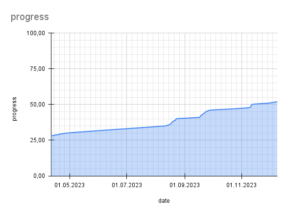

# CTR-in-C

This repository is used for an attempt at decompiling the original CTR assembly into C code. To learn more about projects in this repo, take a look at the readme in [src/README.md](src/README.md).

[![Contributors][contributors-badge]][contributors-link] [![Discord Server][discord-badge]][discord]

[contributors-link]: https://github.com/CTR-Tools/CTR-ModSDK/graphs/contributors
[contributors-badge]: https://img.shields.io/github/contributors/CTR-Tools/CTR-ModSDK

[discord]: https://discord.gg/WHkuh2n
[discord-badge]: https://img.shields.io/discord/527135227546435584?color=%237289DA&logo=discord&logoColor=ffffff

## 🏁 Modding CTR

If you are looking to use mods for CTR, please take a look at [this repo](https://github.com/CTR-tools/CTR-ModSDK) instead.

## Requirements

This SDK requires the installation of [mateusfavarin](https://github.com/mateusfavarin)'s [psx-modding-toolchain](https://github.com/mateusfavarin/psx-modding-toolchain). You can check the repo's readme for instructions on the installation and additional documentation on its usage. All python and pip steps are mandatory.

## Downloading the project

After setting up psx-modding-toolchain, clone this repository
into the local directory psx-modding-toolchain/games:

```
$ git clone https://github.com/CTR-tools/CTR-in-C.git
```



[](https://www.youtube.com/watch?v=V9QlFzSVDAU)

# 🤝 Contributing

Are you interested in contributing? Have any experience in C programming language? You're welcome to join!

## `rewrite` project

The `rewrite` is our second (and preferred) attempt at decompiling CTR, with higher code standards and more rigorous testing than the original `decompile` project (mentioned below). It targets only the NTSC-U build (9/26/99 build date) — there are no considerations for other regional builds.

Like the `decompile`, the `rewrite` adopts the [Ship of Theseus](https://en.wikipedia.org/wiki/Ship_of_Theseus) strategy: using 8MB memory expansion (supported by many PS1 emulators), rewritten functions are loaded alongside the original game, allowing direct comparison between the original and rewritten implementations. The focus is on matching both behavior and API.

### Testing

Pure functions (no global side effects) must have unit tests that call both the original ASM and the rewritten C at runtime and compare outputs. Impure functions should be verified through rigorous testing, integration tests, and/or matching ASM (from the `matching` project) with only trivial restructuring. See the [src/rewrite/README.md](src/rewrite/README.md) for details on the test framework.

### How to contribute

- Make sure you have cloned this repo and installed the requirements (including psx-modding-toolchain).
- The rewrite source lives in [src/rewrite/src/exe/](src/rewrite/src/exe/). Pick a function to rewrite — you can use the [ghidra reference](reference/ghidra) and the `matching` project as guides.
- Write a corresponding test in [src/rewrite/src/tests/](src/rewrite/src/tests/). See the [rewrite README](src/rewrite/README.md) for the testing conventions.
- Note: the `rewrite` uses gcc 15.2. If you've installed deps via psx-modding-toolchain, run `mips` or `mips use <version>` to switch.
- Run `build.bat` and choose "Compile", "Build ISO", then test in PCSX-Redux.
- Once everything is working, feel free to open a pull request!

## `decompile` project

### How to rewrite functions:

- Make sure you have cloned this repo and installed the requirements.
- Choose a function from a *.c file from the [ghidra](reference/ghidra) folder. Each file represents a code section or category. All non-numbered *.c files are parts of the main EXE while the numbered files are overlays.
- Choose a function in that section to rewrite. Read the documentation comments on what the function does and what's the address.
- Set up a compile folder for your rewritten function using psx-modding-toolchain (if it doesn't already exist). You can see ones that already exist in [src/decompile/General](src/decompile/General).

\* Build codenames:  
common: All versions;  
926: USA Retail;  
1006: Japan Trial;  
1020: Europe Retail;  
1111: Japan Retail.  

\**  Code region:  
exe: main EXE;  
221-233: Overlays (use the original .c filename number)

- Run `build.bat` and choose "Compile", "Build ISO", then test the game.
- After you've confirmed that it's functional, add your new function .c file to the [decompile directory](src/decompile).
- Feel free to make a pull request after everything is working!

If you have any questions, reach us out in our [Discord server](https://discord.gg/WHkuh2n).