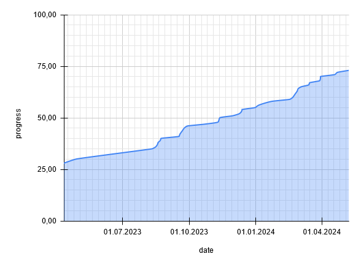

# CTR-ModSDK

*ModSDK*. *(noun)* A toolkit that allows you to create mods for Crash Team Racing (1999) in C.

[![Contributors][contributors-badge]][contributors-link] [![Discord Server][discord-badge]][discord]

[contributors-link]: https://github.com/CTR-Tools/CTR-ModSDK/graphs/contributors
[contributors-badge]: https://img.shields.io/github/contributors/CTR-Tools/CTR-ModSDK

[discord]: https://discord.gg/WHkuh2n
[discord-badge]: https://img.shields.io/discord/527135227546435584?color=%237289DA&logo=discord&logoColor=ffffff

This repository also houses an effort to fully decompile and reverse-engineer [CTR in C.](https://github.com/CTR-tools/CTR-ModSDK#CTR-in-C)

# 🏁 Modding CTR

## Requirements

This SDK requires the installation of [mateusfavarin](https://github.com/mateusfavarin)'s [psx-modding-toolchain](https://github.com/mateusfavarin/psx-modding-toolchain). You can check the repo's readme for instructions on the installation and additional documentation on its usage. All python and pip steps are mandatory.

## Downloading the SDK

After setting up psx-modding-toolchain, clone this repository
into the local directory psx-modding-toolchain/games:

```
$ git clone https://github.com/CTR-Tools/CTR-ModSDK.git
```

- You can find [example mods](https://github.com/CTR-tools/CTR-ModSDK/tree/main/psx-modding-toolchain/games/CrashTeamRacing/mods) in our repo.
- Each mod folder includes a `readme.txt` file on what the mod does and how to use it. 

# CTR-in-C

As mentioned earlier, this repository is also used for an attempt at decompiling the original CTR assembly into human-readable C code. Our decompilation targets **non-matching** code that still functions identically compared to the original code.



[](https://www.youtube.com/watch?v=V9QlFzSVDAU)

## 🤝 Contributing

Are you interested in contributing? Have any experience in C programming language? You're welcome to join!

### How to rewrite functions:

- Make sure you have cloned this repo and installed the requirements.
- Choose a .c file from the [ghidra](https://github.com/CTR-tools/CTR-ModSDK/tree/main/psx-modding-toolchain/games/CrashTeamRacing/ghidra) folder. Each file represents a code section or category. All non-numbered .c files are parts of the main EXE while the numbered files are overlays.
- Choose a function in that section to rewrite. Read the documentation comments on what the function does and what's the address.
- Set up a compile folder for your rewritten function using psx-modding-toolchain. Please refer to the [above section for its installation and usage](https://github.com/CTR-tools/CTR-ModSDK#Downloading%20the%20SDK).

\* Build codenames:  
common: All versions;  
926: USA Retail;  
1006: Japan Trial;  
1020: Europe Retail;  
1111: Japan Retail.  

\**  Code region:  
exe: main EXE;  
221-233: Overlays (use the original .c filename number)

- Run `build.bat` and choose "Compile", "Build ISO", then test the game.
- After you've confirmed that it's functional, add your new function .c file to the [decompile directory](https://github.com/CTR-tools/CTR-ModSDK/tree/main/psx-modding-toolchain/games/CrashTeamRacing/decompile).
- Feel free to make a pull request after everything is working!

If you have any questions, reach us out in our [Discord server](https://discord.gg/WHkuh2n).